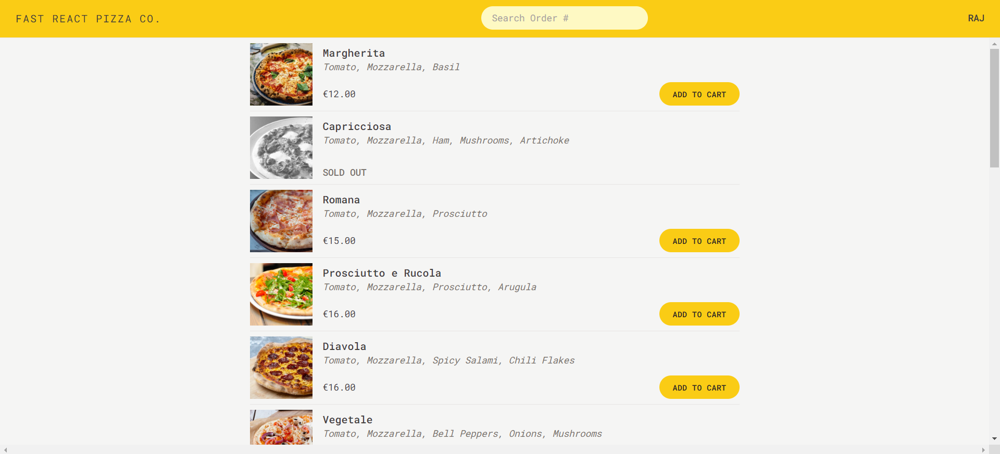

<br/>
<p align="center">
  <a href="https://github.com/rajsinghast03/moviesHub">
    
  </a>

  <h3 align="center">Fast React Pizza</h3>

  <p align="center">
    A Pizza ordering application!
    <br/>
    <br/>
  </p>
</p>


## About The Project



 * A very simple pizza ordering application where user can order one or more pizzas from a menu
 * Modeled user and cart state efficiently using \textbf{Redux Toolkit} for seamless state management and smooth user experience
 * Implemented reverse geocoding API integration to dynamically retrieve and display users' complete addresses
 * Utilized Redux Thunk, specifically the createAsyncThunk function, to implement asynchronous reverse geocoding


### Prerequisites


* npm

```sh
npm install npm@latest -g
```

### Installation

1. Clone the repo

```sh
git clone https://github.com/rajsinghast03/react-pizza.git
```

2. Install NPM packages

```sh
npm install
```


## Contributing

Contributions are what make the open source community such an amazing place to be learn, inspire, and create. Any contributions you make are **greatly appreciated**.
* If you have suggestions for adding or removing projects, feel free to [open an issue](https://github.com/rajsinghast03/moviesHub/issues/new) to discuss it, or directly create a pull request.

### Creating A Pull Request

1. Fork the Project
2. Create your Feature Branch (`git checkout -b feature/AmazingFeature`)
3. Commit your Changes (`git commit -m 'Add some AmazingFeature'`)
4. Push to the Branch (`git push origin feature/AmazingFeature`)
5. Open a Pull Request


